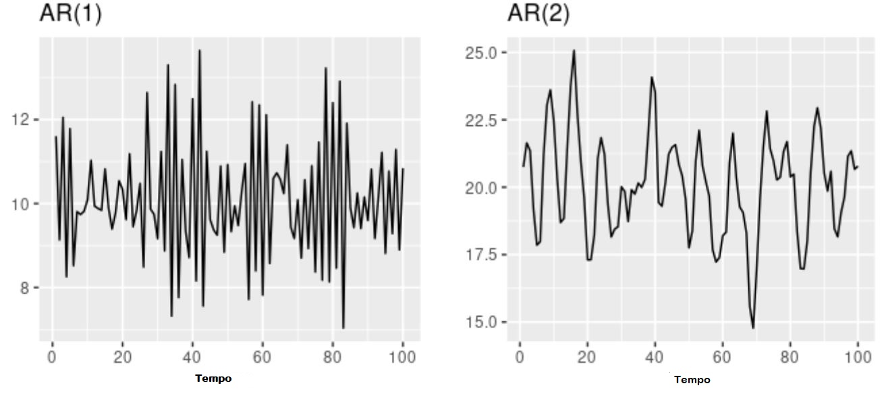

# Modelos ARIMA

Os modelos *Autoregressivos Integrados Médias-Móveis* (ARIMA) é um modelo fundamental para séries univariáveis. O modelo ARIMA é composto por três componentes chaves:

 - *Componente autoregressivo* que é a relação entre a variável dependente atual, a variável dependente em periodos de tempo defasados;
 - *Componente integrado* que refere-se a transformação dos dados, subtraindo os valores anteriores de uma variável dos valors atuais da mesma variável a fim de tornar os dados estacionários;
 - *Componente Média-Móvel* se refere à dependência entre a variável dependente e os valores anteriores de um termo estocástico.
 
## Modelos Auto regressivos

Num modelo autoregressivo, faz-se a previsão da varíavel de interesse usando combinação linear dos valores passados dessa variável. O termo *autoregressivo* indica que é uma regressão da variável contra ela mesma [@hyndman2018forecasting]. Assim um modelo autoregressivo de ordem *p* pode ser escrito como:

\begin{equation}
x_t = \phi_0 + \phi_1 x_{t-1} + \phi_2 x_{t-2} + ...+\phi_p x_{t-p} + \epsilon_t
(\#eq:autoregress)
\end{equation}
com $\epsilon_t$ ruído branco e $\phi_0, \phi_1,...,\phi_p$ parâmetros reais. Refere-se a \@ref(eq:autoregress) como **modelo $AR(p)$** e lê-se *modelo autoregressivo de ordem p*.

Para um modelo $AR(1)$, modelo autoregressivo de ordem $1$ temos os seguintes casos:

- para $\phi_1 = 0$, $x_t$ é equivalente a um ruido branco;
- para $\phi_1 = 1$ e $\phi_0 = 0$, $x_t$ é equivalente a um caminho aleatório (*Random Walk*).
- para $\phi_1 = 1$ e $\phi_0 \neq 0$, $x_t$ é equivalente a um caminho aleatório  com deriva.
- para $\phi_1 < 0$, $x_t$ tende a oscilar à volta da média.

Normalmente restringe-se modelos autoregressivos aos dados estacionários, implicando algumas restrições nos valores dos parâmetros requeridos [@hyndman2018forecasting].

- para um modelo $AR(1)$: $-1 < \phi_1 < 1$
- para um modelo $AR(2)$: $-1 < \phi_2 < 1$, $\phi_1 + \phi_2 < 1$ e $\phi_2 + \phi_1 < 1$
Quando $p\geq3$, as restrições tornam-se muito mais complexas. o *software* R normalmente cuida dessas restriçoes na estimação do modelo.


```{r echo =FALSE, label = 'serieAR',fig.cap='Dados de modelos autoregressivos com parâmetros diferentes (Fonte: [@hyndman2018forecasting])', fig.align='center', out.width='80%'}

```

A figura \@ref(fig:serieAR) representa séries de um modelo $AR(1)$ e $AR(2)$. Alterando os parâmetros $\phi_1,...,\phi_p$, altera o padrão da série. A variância do termo de erro $\epsilon_t$ somente irá mudar a escala das séries, não o padrão. No exemplo da figura \@ref(fig:serieAR) para $AR(1)$ têm-se $x_t = 18-0.8x_{t-1}+\epsilon_t$ enquanto que para o modelo $AR(2)$ têm-se $x_t = 8+1.3x_{t-1} -0.7x_{t-2} + \epsilon_t$. Em ambos os casos, $\epsilon_t$ é um ruído branco normalmente distribuído com média $0$ e variância $1$.

## Modelos Médias Móveis

Ao contrário dos modelos autoregressivos que usam valores passados da variável a ser determinada a previsão, os modelos médias móveis usam erro de previsões anteriores em um modelo semelhante a uma regressão

\begin{equation}
x_t = \phi_0 + \epsilon_t + \phi_1 \epsilon_{t-1} + \epsilon_2 x_{t-2} + ...+\epsilon_q x_{t-q}
(\#eq:mediamovel)
\end{equation}
onde $\epsilon_t$ é um ruído branco. Denomina-se modelo $MA(q)$, ou seja, modelo média móvel de ordem $q$. Cada valor de $x_t$ pode ser pensado como uma média móvel ponderada dos últimos erros da previsão.

```{r echo =FALSE, label = 'serieMA',fig.cap='Dados de modelos médias móveis com parâmetros diferentes (Fonte: [@hyndman2018forecasting])', fig.align='center', out.width='80%'}
knitr::include_graphics("img/MA.JPG")
```
A figura \@ref(fig:serieMA), mostra dados de um modelo $MA(1)$ e de um modelo $MA(2)$. Alterando os parâmetros $\phi_1,...,\phi_q$ resulta em diferentes padrões da série. Semelhantemente aos modelos autoregressivos a variância do termo de erro $\epsilon_t$ somente mudará a escala das séries, não padrão.
Na figura \@ref(fig:serieMA) para $MA(1)$ tem-se $x_t = 20 + \epsilon_t + 0.8\epsilon_{t-1}$, e para $MA(2)$ tem-se $x_t = \epsilon_t -\epsilon_{t-1}+ 0.8\epsilon_{t-2}$. Nos dois casos $\epsilon_t$ é um ruído branco normalmente distribuído com média zero e variância um.

É possível escrever qualquer modelo estacionário $AR(p)$ como um modelo $MA(\infty)$ [@hyndman2018forecasting]. pode-se demonstrar isso para um modelo $AR(1)$ usando substituição.

\begin{align*}
x_t &= \phi_1 x{t-1} + \epsilon_t\\ 
 &=\phi_1(\phi_1 x_{t-2} + \epsilon_{t-1}) + \epsilon_t \\ 
 &= \phi^2_1x_{t-2} + \phi_{1}\epsilon_{t-1} + \epsilon_t\\ 
 &= \phi^3_1 x_{t-3} + \phi^2_1x_{t-2} + \phi_{1}\epsilon_{t-1} + \epsilon_t\\ 
etc...
\end{align*}

Dado $-1<\phi<1$, o valor de $\phi^k_1$ vai ficando mais pequeno quando $k$ for aumentando. finalmente teremos
\begin{equation}
x_t = \epsilon_t + \phi_1 \epsilon_{t-1} + \phi^2_1 \epsilon_{t-2} + \phi^3_1\epsilon{t-3} + ...
(\#eq:MAinfity)
\end{equation}
um processo $MA(\infty)$.
