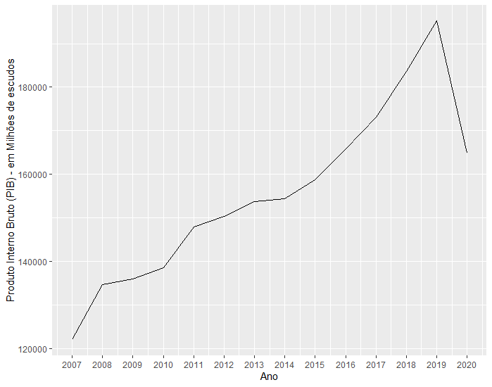
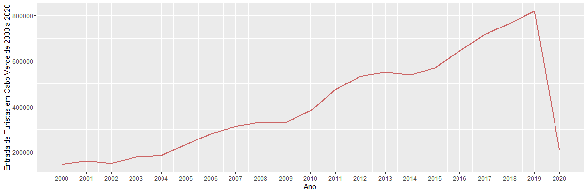
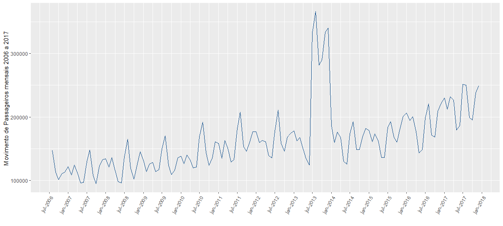

---
output:
  html_document: default
  pdf_document: 
    toc: yes
---
# Séries Temporais

## Introdução

\justify
As previsões são necessárias em várias situações para servir como suporte na tomada de decisões e muitas vezes com vários anos de antecedência. Por exemplo, para uma empresa decidir se vai investir na construção de uma  nova unidade de produção, nos próximos cinco anos, requer previsões sobre a procura dos produtos e sobre o retorno do investimento no futuro. Para se decidir sobre a implementação de determinada política económica-financeira, as autoridades de um determinado país precisam de previsões para análise da viabilidade da implementação dessa política.

Alguns eventos são mais fáceis de prever do que outros. Por exemplo, pode-se prever com alto grau de precisão, a que horas será o pôr do sol daqui a uma semana, mas a previsão de qual a equipa que irá vencer o próximo campeonato do mundo de futebol não pode ser feita com 100% de certeza. Segundo Hyndman [-@hyndman2018forecasting], a previsibilidade  de um evento depende de vários fatores, tais como:

* Nível de conhecimento dos factores que afectam o evento;
* Quantidade de dados disponíveis;
* Efeito que o conhecimento da previsão poderá ter no próprio evento.
  
Por exemplo, a previsão do consumo de eletricidade pode ser feita com alto grau de precisão, pois as três condições acima são normalmente satisfeitas. Têm-se ideia dos fatores que podem afetar o consumo de eletricidade (temperatura, época do ano, condições económicas da população, etc.); normalmente têm-se dados do passado relativamente ao consumo de eletricidade; a previsão determinada normalmente não influencia o consumo de eletricidade no futuro [@hyndman2018forecasting]. No caso de previsões de taxas de câmbio somente a segunda condição é satisfeita, visto que se tem conhecimento limitado dos fatores externos que podem afetar as taxas de câmbio, a previsão e publicação das previsões das taxas de câmbio podem afetar a taxa de câmbio no futuro.

Geralmente, os métodos usados nas previsões analisam dados do passado para tentar fazer previsões sobre valores futuros [@xavier2016analise]. O método apropriado a usar nas previsões depende muito dos dados disponíveis. Quando não existem dados disponíveis, ou se os dados não são muito relevantes para a previsão, usam-se **métodos de previsões qualitativas**, que são métodos bem desenvolvidos estruturados para obter previsões sem usar dados históricos [@hyndman2018forecasting].

Os **métodos de previsão quantitativos** são aplicados quando as seguintes condições são satisfeitas:

1. Dados numéricos sobre o passado estão disponíveis;
2. É razoável assumir que alguns padrões verificados no passado continuarão no futuro.

Existem vários métodos de previsões quantitativas dos mais simples aos mais complexos, normalmente desenvolvidos para áreas e propósitos específicos. Uma grande parte dos métodos quantitativos usam dados em forma de *séries temporais* (recolhidos em intervalos regulares ao longo do tempo) ou dados de *corte transversal*, também chamados *cross-sectional* (relativos a um dado instante ou período de tempo).

Em economia há dois procedimentos predominantes no processo de previsão: *modelos econométricos* e *modelos de séries temporais*.  *Métodos econométricos* são métodos de previsões que determinam futuros movimentos numa variável relacionando-a com um conjunto de outras variáveis de forma causal. Esses modelos aplicam teorias económicas para construir modelos que podem incluir várias variáveis. Por exemplo, um modelo econométrico para determinar a taxa de juros, pode utilizar  dados de variáveis como PIB, preços, dinheiro em circulação, etc., através dos métodos de regressão como na equação \@ref(eq:linreg), onde $X_{i1}$ e $X_{i2}$ são as variáveis explicativas, $\beta_0$, $\beta_1$, $\beta_2$ são os coeficientes da regressão, $\varepsilon_i$ o erro e $Y_i$ a variável a ser estimada.

\begin{equation}
Y_i = \beta_0 + \beta_1X_{i1} +\beta_2X_{i2} + \varepsilon_i.
(\#eq:linreg)
\end{equation}

Em determinadas situações o uso de modelos econométricos pode ser difícil ou impossível. Por exemplo, se não houver dados disponíveis para as variáveis explicativas $X_{i1}$ e $X_{i2}$ que permitam a determinação dos coeficientes $\beta_0$, $\beta_1$, $\beta_2$, ou se os dados disponíveis resultarem em erros $\varepsilon_i$ muito grandes.

Outros métodos muito utilizados nas previsões, são os métodos de *séries temporais* que usam dados históricos da variável a ser estimada (podem também utilizar dados de outras variáveis). Modelos de previsão de séries temporais são muitas vezes caracterizados como *método sofisticado de extrapolação* [@pindyck2008econometric]. O foco desse trabalho é justamente previsão com método de séries temporais. Informação adicional sobre previsão usando métodos econométricos pode ser consultado em [@pindyck2008econometric].


## Séries temporais

Uma série temporal é um conjunto de observações ordenadas no tempo da característica quantitativa de interesse e que são usualmente registadas em intervalos regulares. Como exemplo de séries temporais temos:

i. Estimativas trimestrais do PIB de um país;
ii. Valores diários de temperatura em Cabo Verde;
iii. Cotações diárias das ações do Banco Comercial do Atlântico na Bolsa de Valores de Cabo Verde;
iv. Valores mensais de vendas numa determinada empresa;
v. Registo de marés na ilha de Santiago - Cabo Verde.

As séries dos exemplos (i) a (iv) são séries temporais *discretas*, enquanto a série do exemplo (v) é *contínua* [@morettin1981modelos]. As séries temporais contínuas podem ser transformadas em discretas se for considerado uma amostragem em intervalos de tempos iguais. Dessa forma, para analisar a série v. será preciso usar uma amostra, por exemplo, em intervalos de uma hora, convertendo a série contínua numa discreta com $N$ pontos. 

Podemos ver na figura \@ref(fig:serie1), a representação de dados em forma de série temporal, relativos ao PIB de Cabo Verde entre 2007 e 2020 (Fonte: INE).
```{r echo =FALSE, label = 'serie1',fig.cap='PIB de Cabo Verde a preços correntes entre 2007 – 2020', fig.align='center', out.width='65%'}

```

### Objetivos da análise de séries temporais

Ao analisar uma série temporal, espera-se que exista uma causa relacionada com o tempo, que influenciou os dados no passado e que continuará a influenciar futuramente [@xavier2016analise]. Segundo Morettin [-@morettin1981modelos] o objetivo da análise de séries temporais é de construir modelos para as séries, com propósitos determinados.

Podemos destacar os seguintes objetivos da análise de séries temporais segundo Xavier [-@xavier2016analise]:

1. Determinar as propriedades de uma série, como sazonalidades, estacionaridade padrão de tendência, etc.
2. Desenvolver um modelo estatístico que permita explicar o comportamento da série no período observado;
3. Estimar valores futuros de uma série temporal, com base em dados históricos;
4. Tomar medidas para controlar determinado processo.

De acordo com Morettin [-@morettin1981modelos] existem dois enfoques usados na análise de séries temporais para o alcance dos objetivos acima. No primeiro enfoque, a análise é feita no *domínio temporal* e os modelos propostos são *modelos paramétricos* (com número finito de parâmetros). Pode-se destacar nos modelos paramétricos os modelos ARIMA. No segundo enfoque, a análise é conduzida no *domínio de frequências* e os modelos propostos são *modelos não paramétricos*. No domínio de frequências tem-se a *análise espectral*, que tem aplicações em ciências físicas e engenharia que consiste em decompor a série inicial em componentes de frequência onde a existência de *espectro* é a característica fundamental. Para esse trabalho não será estudado este tipo de análise, podendo-se consultar [@box1994pages] para mais detalhes.

Quer no domínio temporal, quer no domínio de frequências, são construídos *modelos probabilísticos* ou *estocásticos* para atingir os objetivos acima. Os modelos construídos devem ser simples e parcimónicos, ou seja, deve-se ter o menor número possível de parâmetros, e sempre que possível, a utilização dos modelos não deve apresentar dificuldades às pessoas interessadas em aplicá-los [@morettin1981modelos].

## Processos estocásticos

Os modelos que se utilizam para descrever séries temporais são processos estocásticos, ou seja, processos controlados por leis probabilísticas. Para Chatfield [-@chatfield2000time], a maioria das séries temporais são estocásticas, ou aleatórias, isto é, o futuro é apenas parcialmente determinado por valores passados, sendo o modelo para estas séries muitas vezes chamado *processo estocástico*.


```{definition, name="Fenómenos Aleatórios"}
São fenómenos naturais em que se supõe a intervenção do acaso no sentido em que não é possível, a partir do passado prever determinísticamente o futuro.
```
Os fenómenos aleatórios que se desenrolam no tempo são objeto de estudo dos *processos estocásticos*, isto é, os modelos matemáticos que descrevem os fenómenos aleatórios que evoluem ao longo do tempo.

```{definition, name= "Processo Estocástico"}
Dado um espaço de probabilidade $(\Omega, F, P)$ e um conjunto $T$, *processo estocástico* é uma função $X(t, w)$ definida no produto cartesiano $T\times \Omega$, que para cada $t \in T$ é uma variável aleatória. Simbolicamente escreve-se:
```
\begin{equation}
X = \{X_t, t \in T\}.
(\#eq:procestoc)
\end{equation}

Assim, um processo estocástico é uma família de variáveis aleatórias $X = \{X_t, t \in T\}$ definidas num mesmo espaço de probabilidade $(\Omega, F, P)$. Normalmente $T$ é tomado como o conjunto $\mathbb{Z}$ ou o conjunto  dos números reais $\mathbb{R}$.
Para cada $\omega _0 \in \Omega$, $X(w_0,t) = x(t)$ é uma função não aleatória de $t$ com domínio em $T$. Assim podemos identificar um *processo estocástico* como sendo um sistema que, a cada ponto $\omega_0 \in \Omega$ faz corresponder uma função de parâmetro $t$. Cada uma dessas funções chama-se  *realização* ou *trajetória* do processo, ou ainda, uma *série temporal* [@hamilton2020time]. A totalidade das realizações $X^{(1)}_t,\ X^{(2)}_t, ...$ designa-se por *ensamble*.

### Classificação dos processos estocásticos
O conjunto dos valores $X_t, t \in T$ é chamado *espaço dos estados*, *E*, do processo estocástico e os valores de $X_t$ são chamados *estados*, ou seja, *E* é o conjunto dos possíveis valores das variáveis aleatórias $X_t, t\in T$.


* Se $T$ e $E$ forem conjuntos discretos diz-se  que $X$ é um processo estocástico de tempo discreto com espaço de estados discreto.
* Se $T$ for discreto e $E$ contínuo, diz-se que $X$ é um processo estocástico de tempo discreto com espaço de estados contínuo.
* Se $T$ contínuo e $E$ discreto, diz-se que $X$ um processo estocástico de tempo contínuo com espaço de estados discreto.
* Se $T$ e $E$ são contínuos diz-se que $X$ um processo estocástico de tempo contínuo com espaço de estados contínuo.

### Lei de probabilidade de um processo estocástico

Sejam $\{t_1, t_2,...,t_n\}$ elementos quaisquer do conjunto $T$ pode-se determinar a lei de probabilidade conjunta do vector aleatório $(X_{t_1}, X_{t_2},...,X_{t_n})$ de dimensão finita $n$, através da função de distribuição conjunta:
\begin{equation}
F_{(X_{t_1}, X_{t_2},...,X_{t_n})}(x_1, x_2,...,x_n) = P(X_{t_1}\leq x_1, X_{t_2}\leq x_2,..., X_{t_n}\leq x_n ).
\end{equation}

O conjunto de todas as leis de probabilidade, definida por:
\begin{equation*}
F_{(X_{t_1}, X_{t_2},...,X_{t_n})}:(t_1, t_2,...,t_n \in T)
\end{equation*}

é conhecida como *família de distribuições de dimensão finita* do processo estocástico. Geralmente, quando $t$ é discreto, o conhecimento das funções de distribuição de dimensão finita permite a determinação da probabilidade de qualquer acontecimento associado ao respetivo acontecimento [@hamilton2020time].

```{definition, name="Incrementos Independentes"}
O processo estocástico $X = \{X_t, t \in T\}$ diz-se *processo estocástico com incrementos independentes* sse $\forall n, \forall t_1, t_2,...,t_n \in T : t_1<...<t_n$ as variáveis aleatórias $X_{t_1} - X_{t_2},...,X_{t_n} - X_{t_{n-1}}$ são independentes.
```
A definição acima é importante do ponto de vista da modelação, visto que que permite descrever fenómenos cujos resultados são independentes em intervalos de tempo disjuntos

```{definition, name="Incrementos estacionários"}

O processo estocástico $X = \{X_t, t \in T\}$ diz-se *processo estocástico com incrementos estacionários* sse $\forall s,t \in T(s < t)$ a distribuição de incrementos $X_{t} - X_{s}$ depende  apenas da amplitude $t-s$.
```
Ou seja, a distribuição de resultados em qualquer intervalo de tempo depende unicamente da amplitude do intervalo. Quando um processo estocástico tem incrementos independentes e estacionários simultaneamente diz-se *processo com incrementos independentes e estacionários*.

```{definition, name="Processo de segunda ordem"}

O processo estocástico $X = \{X_t, t \in T\}$ diz-se *processo real de segunda ordem* se
\begin{equation*}
\forall t \in T, E(X^{2}_t) < \infty.
\end{equation*}
```
Exemplos clássicos de um processo de segunda ordem são:

1. **Ruído Branco** ou *white noise* $(X_t, t \in T)$ define-se por:
  * $\forall t \in T, E(X_t)=0$;
  * $\forall t \in T, V(X_t)=\sigma^2$;
  * $\forall s,t \in T : s\neq t,Cov(X_s,X_t)=0$.
2. **Processo Gaussiano** $(X_t, t \in T)$  tal que $\forall n \in \mathbb{N}, \forall t_1,...,t_n \in T,$ $(X_{t_1}, X_{t_2},...,X_{t_n})$ é vector aleatório Gaussiano.

### Processos estacionários

Os modelos de séries temporais a serem desenvolvidos nos próximos capítulos são todos baseados na suposição de que as séries são geradas por um processo estocástico. Por outras palavras, assumimos que cada valor $X_{t_1}, X_{t_2},...,X_{t_n}$ é extraído aleatoriamente de uma distribuição de probabilidade. Ao modelar esses processos, tentamos descrever as características da sua aleatoriedade. Isso nos permite inferir, até certo ponto, sobre as probabilidades associados aos valores futuros alternativos da série.

Se pudéssemos numericamente especificar a função de distribuição de probabilidade das séries, poderíamos determinar resultados futuros. Infelizmente a determinação de tal função de distribuição é, normalmente, impossível. Entretanto, é possível construir um modelo simplificado de séries temporais que explicam a aleatoriedade, de maneira útil para previsões. O modelo simplificado construído não precisa (e normalmente não) produzir obrigatoriamente os valores passados conhecidos, uma vez que a série e o modelo são estocásticos. Esse modelo deve simplesmente capturar as características da aleatoriedade da série analisada [@pindyck2008econometric].

Segundo Hamilton [-@hamilton2020time], poderemos ter as seguintes classes de processos:

* Processos estacionários ou não estacionários, consoante a independência relativamente à origem dos tempos;
* Processos normais (Gaussianos) ou não normais, de acordo com as fdp que caracterizam os processos;
* Processos Markovianos ou não Markovianos, consoante a independência dos valores em instantes precedentes.

Assim um processo $X$ é estacionário se desenvolver no tempo de modo que a escolha de uma origem dos tempos não seja importante, ou seja, as características de $X_{t + \delta}$, para todo $\delta$, são as mesmas de $X_t$.

Em termos gerais, os processos estacionários traduzem situações em que o sistema se apresenta num estado de equilíbrio estatístico em torno de um nível médio fixo, isto é, tem propriedades probabilísticas estáveis ou invariantes ao longo do tempo.


```{definition, name="Função de covariância"}
Uma função real 
\begin{equation*}
\begin{matrix}
\gamma:T\times T\rightarrow \mathbb{R}\\ 
(s,t) \rightarrow \gamma(s,t)
\end{matrix}
\end{equation*}
é uma função de covariância de um processo estocástico real de segunda ordem sse $\gamma$ é uma função simétrica e definida positiva.
```

Por outras palavras, $\gamma$ é uma função de covariância se satisfazer as seguintes condições:
* $\gamma(0) >0$;
* $\gamma(-h) = \gamma(h)$;
* $\left | \gamma(t) \right | \leq \gamma(0)$
* $\gamma(t)$ é **positiva definida**, no sentido que 

\begin{equation}
\sum_{j=1}^{n}\sum_{k=1}^{n}a_ja_k\gamma(t_j-t_k) \geq 0, \forall n\in \mathbb{N}, \forall a_j \in \mathbb{R}, j=1,...,n.
\end{equation}


```{definition, name="Função de autocorrelação"}
A função de autocorrelação é definida por

\begin{equation}
\rho = Corr(X_t,X_{t+h}) = \frac{Cov(X_t,X_{t+h})}{\sqrt{V(X_t)}\sqrt{V(X_{t+h})}} = \frac{\gamma(h)}{\gamma(0)}.
\end{equation}
```

Como usualmente é quase impossível obter uma descrição completa de um processo estocástico (isto é, especificar a função de distribuição de probabilidade correspondente), a função de autocorrelação demonstra-se muito útil porque ela fornece uma descrição parcial do processo para efeito de modelação. A função autocorrelação indica o nível de correlação existente entre pontos vizinhos de uma série e ela é usada normalmente para identificar um modelo adequado para a série temporal $X_t$ [@pindyck2008econometric].

```{definition, name="Estacionaridade forte"}
Um processo estocástico $X = \{X_t, t \in T\}$ diz-se *fortemente estacionário*, se $\forall n \in \mathbb{N}, t_1, t_2,...,t_n \in T : t_1<...<t_n$,

\begin{equation}
(X_{t_1},...,X_{t_n}) \overset{\mathrm{d}}{=} (X_{t_{1 + h}},...,X_{t_{n+h}}) com h > 0,
\end{equation}

isto é,

\begin{equation}
P(X_{t_1}\leq x_1,...,X_{t_n} \leq x_n) = P(X_{t_{1+h}}\leq x_1,...,X_{t_{n+h}} \leq x_n).
(\#eq:estforte)
\end{equation}
```

De acordo com Shumway [-@shumway2000time] a estacionaridade em \@ref(eq:estforte) é muito forte para a maioria das aplicações. Em vez de impor condições para todas as possíveis distribuições de uma série temporal, pode-se usar uma versão mais "mansa" que impõe condições somente nos primeiros dois momentos das séries (momentos de segunda ordem). Teremos então a seguinte definição:

```{definition, name="Estacionaridade fraca"}
Um processo estocástico $X = \{X_t, t \in T\}$ diz-se *fracamente estacionária*, se 

* $\forall t \in T, E(X^{2}_t) < \infty$ (processo de segunda ordem);
* $\forall t \in T, E(X_t) = \mu$ (independente de $t$);
* $\forall t, s \in T, \Gamma(s,t) = Cov(X_s, X_t) = \gamma(\left | t-s \right |)$.
  
```

Daqui em diante usaremos o termo **estacionária** em vez de **fracamente estacionária**. Se um processo for fortemente estacionário, usaremos o termo **estritamente estacionária** ou **fortemente estacionária**
Os processos estacionários são apropriados para modelar fenómenos aleatórios cujo comportamento parece não mudar muito com o tempo [@shumway2000time].

Existem vários tipos de não estacionaridade, mas nos próximos capítulos veremos que tais processos podem ser transformados em processos estacionários através de diferenças sucessivas.


## Tendência e sazonalidade das séries temporais

Dois dos principais motivos que causam variações na maioria das séries temporais são a *tendência* e a *sazonalidade*. Pode-se definir **tendência** como um comportamento de longo prazo da série temporal. Normalmente esse tipo de variação está presente quando uma série apresenta constante crescimento ou declínio, em sucessivos períodos [@xavier2016analise].

Na figura \@ref(fig:serie2) temos a representação da entrada de turistas em Cabo Verde do ano 2000 ao ano 2020 (Fonte: INE). Uma simples análise visual permite observar uma tendência de crescimento até finais do ano 2019. Em 2020 pode-se ver uma grande queda na entrada de turistas, devido ao impacto do da Covid-19 que assolou o mundo em 2020.

Uma pequena análise gráfica pode dar uma ideia do comportamento dos dados, mas temos sempre que realizar testes estatísticos específicos para concluir sobre determinado comportamento dos dados, nesse caso, a tendência. Veremos mais adiante alguns métodos usados para detetar a existência de tendência em séries temporais.

```{r echo =FALSE, label = 'serie2',fig.cap='Entrada de turistas em Cabo Verde de 2000 – 2020', fig.align='center', out.width='80%'}

```

Se considerarmos que a série temporal não apresenta a componente sazonal, poderemos escrever o modelo

\begin{equation}
X_t = T_t + \varepsilon_t.
(\#eq:tendencia)
\end{equation}
onde $\varepsilon_t$ é um ruído branco (uma variável aleatória com média zero e variância $\sigma^{2}$) e $T_t$ o estimador da tendência. Existem vários métodos para estimar $T_t$. Segundo Hamilton [-@hamilton2020time] os mais utilizados são:

1. Ajustar uma função do tempo, como um polinómio, uma exponencial ou outra função suave de $t$;
2. Suavizar (ou filtrar) os valores da série ao redor de um ponto, para estimar a tendência naquele ponto.

Após estimada a tendência $\hat{T}_t$, podemos considerar a série ajustada para a tendência ou livre da tendência,

\begin{equation}
Y_t = X_t - \hat{T}_t.
\end{equation}

Outro procedimento que é também utilizado para eliminar a tendência de uma série, consiste em tomar sucessivas diferenças da série original até encontrar uma estacionária. Segundo Morettin [@morettin1981modelos], em séries económicas, é frequente conseguir a estacionaridade com as primeiras diferenças.
\begin{equation}
\Delta X_t = X_t - X_{t-1}.
\end{equation}

O testes mais utilizados para identificar tendências são:

1. *Teste de Sequências* (Wald-Wolfowitz);
2. *Teste do Sinal* (Cox - Stuart);
3. *Teste baseado no coeficiente de correlação de Spearaman*.

```{definition, name= "Operador de Diferenças"}
Define-se operador de diferenças por:
\begin{equation}
Bx_t = x_{t-1}
\end{equation}
```
e pode ser extendido para outros expoentes $B^2x_t = B(Bx_t) = Bx_{t-1} = x_{t-2}$, e assim por diante. Temos então:
\begin{equation}
B^kx_t = x_{t-k},
\end{equation}

Dado a diferença de primeira ordem $\triangledown x_t = x_t-x_{t-1}$, a mesma pode ser escrita como:
\begin{equation}
\triangledown x_t = (1-B)x_t.
\end{equation}

Podemos então estender a notação para ordens superiores. Por exemplo, o operador de diferenças de segunda ordem será:

\begin{equation}
\begin{aligned} 
\triangledown ^2x_t & = (1-B)^2x_t = (1-2B+B^2)x_t\\
                    & =x_t-2x_{t-1}+x_{t-2}.
\end{aligned}
\end{equation}

```{definition, name= "Diferenças de ordem d"}
São definidas como:
\begin{equation}
\triangledown^d x_t = (1-B)^d
\end{equation}
```
Pode-se expandir o operador $(1-B)^d$ algebricamente para avaliar o maior valor inteiro de $d$. Quando $d=1$ escreve-se simplesmente $(1-B)$.

A primeira diferença, $\triangledown x_t = x_t-x_{t-1}$, é um exemplo de filtro linear que pode ser aplicado para eliminar a tendência da série. Outros filtros, formados pela média dos valores perto de $x_t$ podem produzir séries ajustadas que eliminam outros tipos de flutuações indesejáveis [@shumway2000time]. O método da diferença, foi desenvolvido por Box e Jenkins [@box1994pages] e é um componente importante na aplicação do modelo ARIMA.

A **Sazonalidade** é um tipo de variação onde fenómenos que ocorrem durante o tempo se repetem a cada período idêntico de tempo, por exemplo, o aumento de vendas de uma loja todos os anos no período de Natal.
A sazonalidade pode ser dividida em dois tipos, *sazonalidade determinista*, quando o padrão sazonal é regular e estável no tempo, ou *sazonalidade estocástica* quando o padrão sazonal varia como tempo [@xavier2016analise].

A Figura \@ref(fig:serie3) representa o movimento de passageiros nos aeroportos de Cabo Verde entre o ano 2006 e o ano 2017 (Fonte: INE). Pode-se observar que o mês de julho normalmente têm maior tráfego de passageiros nos aeroportos de Cabo Verde, possivelmente devido ao período de férias escolares e também por coincidir com o início do verão, onde aumenta o fluxo de turistas que visitam Cabo Verde. Trata-se assim de dados que apresentam um padrão sazonal, pois tem comportamento semelhante em certos períodos (nesse caso no mês de julho).

```{r echo =FALSE, label = 'serie3',fig.cap='Movimento de passageiros nos aeroportos de Cabo Verde de 2006 – 2017', fig.align='center', out.width='90%'}

```

Existem vários procedimentos para se estimar a sazonalidade, sendo que as mais utilizadas são os *métodos de regressão* e os *métodos de médias móveis*. Os métodos de regressão são mais apropriados para séries que apresentam sazonalidade determinística, ou seja, pode ser prevista normalmente a partir de comportamento dos dados em períodos anteriores [@hamilton2020time]. Já o método de médias móveis é mais apropriado para séries temporais cuja componente sazonal varia com o tempo, isto é, séries de sazonalidade estocástica.


Os testes mais utilizados para estimar a sazonalidade são

1. *Teste de Kruskal-Wallis*, para várias amostras independentes;
2. *Teste de Friedman*, para amostras dependentes/emparelhadas;
3. *Teste F* para determinar sazonalidade determinística.

Outra abordagem seria incorporar a variação sazonal e a tendência num modelo ARIMA (será estudado no próximo capítulo).


## Análise de séries temporais

### Teste da normalidade

Existem alguns testes utilizados para  verificar se os dados de uma série temporal são normalmente distribuídos. Entre esses testes podemos destacar o teste de Shapiro-Wilk, o teste de Doornik-Hansen, o teste de Lillefors e o teste de Jarque-Bera. Nesses testes, parte-se da hipótese nula de que os dados provêm de uma distribuição normal, e a hipótese alternativa é de que os dados não provêm de uma distribuição normal.

### Teste da raiz unitária ou teste de estacionaridade

Como explicado anteriormente, numa série temporal em que as propriedades não se alteram ao longo do tempo é chamada de série estacionária. Fazendo a análise de uma representação gráfica de uma série temporal, pode-se ter uma ideia se a série é estacionária ou não. Entretanto, somente a visualização gráfica é insuficiente para concluir sobre a estacionaridade da série. Assim como para a normalidade, existem alguns testes usados para se estudar a existência de estacionaridade duma série temporal, sendo que a maioria deles baseiam-se em encontrar uma raiz unitária.  Alguns testes mais utilizados são os testes de Dickley-Fuller Aumentado, o teste de Phillips-Perron e o teste KPSS [@xavier2016analise].

#### Teste de Dickey-Fuller Aumentado

Também é conhecido como teste ADF (Augmented Dickley-Fuller) e tem como base a seguinte regressão:

\begin{equation}
\Delta x_t = \beta_1 + \beta_2t + \delta x_{t-1}+\sum_{i=1}^{m}\alpha _i\Delta x_{t-1} + \varepsilon_t;
\end{equation}

- $\beta_1$ é o ponto de interceto ou *drift* da série;
- $\beta_2$ é o coeficiente da tendência;
- $\delta$ é o coeficiente de presença de raiz unitária;
- $m$ é o número de desfasagem tomada na série.

No teste  ADF, consideram-se as seguintes hipóteses

- $H_0:\delta=0$ Existe pelo menos uma raiz unitária.
- $H_1:\delta \neq 0$ A série não é estacionária.

Será feita então uma regressão de $\Delta x_t$ em $\Delta x_{t-1}$,...,$\Delta x_{t+p-1}$, e logo a seguir é calculada a estatística $T$, que é dada por:

\begin{equation}
T = \frac{\hat{\delta}}{se(\hat{\delta})},
\end{equation}

onde $\hat{\delta}$ é o estimador para $\delta$ e $se(\hat{\delta)}$ o estimador para o desvio padrão do erro de $\delta$. Os valores críticos de $T$ são calculados por Dickley e Fuller através da simulação Monte Carlo [@xavier2016analise].

#### Teste de Phillips-Perron

Esse teste é a generalização do teste de Dickley-Fuller para os casos em que os erros {${\varepsilon_t}$}, $t \in \mathbb{Z}$ são correlacionados e, possivelmente, heterocedásticos. Baseando-se na regressão

\begin{equation}
\Delta x_t = \beta_1 + \beta_2t + \delta x_{t-1}+\sum_{i=1}^{m}\alpha _i\Delta x_{t-1} + \varepsilon_t,
\end{equation}

a estatística $Z$ é calculada por:

\begin{equation}
Z = n \hat{\delta}_n - \frac{n^2 \hat{\delta}^2}{2s_n^2}(\hat{\lambda_n^2}-\hat{\gamma_{0,n}}), onde:
\end{equation}

- $\hat{\gamma}_{j,n} = \frac{1}{n}\sum_{i=1+j}^{n}r_ir_{i-j}$;
- $\hat{\lambda}_n^2 = \hat{\gamma}_{0,n} + 2\sum_{j=1}^{q}\left ( 1-\frac{j}{q+1} \right )\hat{\gamma}_{j,n}$;
- $s_n^2 = \frac{1}{n-k} \sum_{j=1}^{n}r_i^2$.

Com, $r_i$ o resíduo de $x_i$ utilizando estimadores de mínimos quadrados, $k$ o número de covariáveis na regressão e $q$ o número de desfasagem utilizadas para calcular$\hat{\lambda}_n^2$.

Quando o processo for não correlacionado as covariâncias são nulas e então $\hat{\lambda}_n^2 = \hat{\gamma}_{0,n}$. Se o processo não for heterocedástico teremos $se(\delta) = \frac{1}{n}$ e $Z$ será dado por $Z= n\hat{\delta} = \frac{\hat{\delta}}{se(\hat{\delta})}$. Ou seja, $Z$ transforma-se numa estatística de Dickley-Fuller, portanto, terá a mesma distribuição do teste ADF.

#### Teste KPSS

Esse teste foi criado por Denis Kwiatkowski, Peter C. B. Phillips, Peter Schmidt e Youngcheol Shin, e tem por objetivo determinar a estacionaridade duma série temporal. As hipóteses para se determinar a estacionaridade são:

- $H_0$: A série é estacionária;
- $H_1$: A série apresenta raiz unitária.

A estatística do teste KPSS é definida por:

\begin{equation}
LM = \sum_{t=1}^{N}\frac{s_t^2}{N^2\hat{\sigma}_{\varepsilon}^2},
\end{equation}

onde $s_t$ é a soma parcial dos resíduos e $\hat{\sigma}_{\varepsilon}^2$ o estimador para a variância dos erros da regressão.
