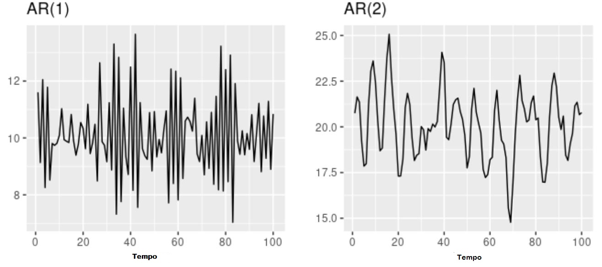

# Modelos Matemáticos para previsão de séries temporais

Um método de previsão, normalmente, tem associado alguns procedimentos que, de acordo com os dados históricos disponíveis, permite prever o comportamento dos mesmos no futuro. Os métodos de previsão de séries temporais tem como base a suposição de que os dados passados contêm as informações sobre o padrão de comportamento da série.

De acordo com Chatfield [@chatfield2000time], podemos classificar os métodos de previsão em três tipos

* **As previsões julgamentais** (*Judgemental*), que se baseia no julgamento subjectivo, intuição e na experiência sem qualquer outra informação revelante.
* **Métodos univariados**, em que as previsões dependem apenas dos valores passados de uma única variável, podendo ser auxiliada por uma função de tempo ou por uma tendência linear. Nesse trabalho a ênfase será nesses métodos.
* **Métodos multivariados**, onde as previsões de uma variável dependem dos valores de uma ou mais variáveis adicionais, chamados variáveis explicativas.


Existem vários métodos dos mais simples aos mais complexos, mas nem sempre os mais complexos produzem os melhores resulados, por isso será necessário avaliar as vantagens dos métodos antes de se iniciar a previsão.
Ao escolher o método, deve-se ter em atenção alguns instrumentos para avaliação do erro.

* Análise gráfica;
* Diagrama de dispersão;
* Coeficiente de correlação;
* Erro quadrático acumulado;
* Raíz do erro médio quadrático (RMSE);
* Erro percentual absoluto (MAPE)

Podem-se classificar os modelos para séries temporais em duas classes, de acordo como o número de parâmetros envolvidos [@hamilton2020time]:

* **Modelos paramétricos**, onde o número de parâmetros é finito;
* **Modelos não paramétricos**, o número de parâmetros é infinito.

Nos modelos *paramétricos*, a análise é feita no domínio do tempo. De entre esses modelos, os mais utilizados são os modelos de regressão (ou de erro), os modelos autoregressivos - médias móveis(ARMA) e os modelos autoregressivos-integrados-médias móveis (ARIMA). 
Os modelos não paramétricos mais frequentemente usados são a função de auto-covariância (ou auto-correlação) e sua transformada de Fourier, o *espectro*.


Pode-se escrever a série temporal observada na forma
\begin{equation}
X_t = f(t) + \epsilon_t, t=1,...,n,
(\#eq:sinal)
\end{equation}
onde $f(t)$ é denominado *sinal* e $\epsilon_t$ o *ruído*

De acordo com as hipóteses estabelicidas para \@ref(eq:sinal), podem-se ter duas classes de modelos, os modelos de regressão  ou os modelos ARIMA.


## Modelos de erros ou de regressão

Esse são os modelos mais clássicos e provavelmente os primeiros a serem utilizados [@hamilton2020time]. Nesses modelos, o sinal de $f(t)$ em \@ref(eq:sinal), é uma função completamente determinada (parte sistemática determinística) e $\epsilon_t$ é uma sequência aleatória, independente de $f(t)$ [@hamilton2020time]. Supõe-se que as variáveis aleatórias $\epsilon_t$ não são correlacionadas, têm média zero e variância constante, isto é,

\begin{equation}
E(\epsilon_t) = 0,\\
E(\epsilon^{2}_t) = \sigma^{2}_{\epsilon},\\
E(\epsilon_t, \epsilon_s) = 0,  \text{  para  } s\neq s
(\#eq:sistdeter)
\end{equation}

Nessas condições, a série $\epsilon_t$ é chamada de *ruído branco*, como mencionado anteriormente.

Desta maneira, qualquer efeito do tempo influência somente a parte determinística $f(t)$ e os modelos onde $X_t$ depende funcionalmente de $X_{t-1}, X_{t-2},...$ não estão incluídos em \@ref(eq:sinal) com estas suposições.Seguem-se alguns exemplos desses métodos.

### Modelo de tendência linear

\begin{equation}
X_t = \alpha + \beta t + \epsilon_t,  \text{  com   } t = 1,...,n
(\#eq:tlinear)
\end{equation}
com $f(t) = \alpha + \beta t$, que é uma função linear dos parâmetros.
 
### Modelo de regressão:

\begin{equation}
X_t = \alpha + \beta X_t + \epsilon_t,  \text{  com  }  t = 1,...,n
(\#eq:regress)
\end{equation}
com $f(t) = \alpha + \beta X_t$, sendo $x_t$ uma quantidade observável e $f(t)$ um função linear de parâmetros.
Nestes casos os parâmetros podem ser estimados usando-se o método de mínimos quadrados.
 
### Modelos de curva de crescimento

\begin{equation}
X_t = \alpha + e^{\beta t + \epsilon_t}, \text{ ou } X_t=\log \alpha +\beta t+\epsilon_t  
(\#eq:curvcresc)
\end{equation}

Neste caso, $f(t)$ não é uma função linear dos parâmetros, embora $log (X_t)$ o seja. Segundo Hamilton [@hamilton2020time] normalmente, há dois tipos diferentes de funções para $f(t)$


1. Polinómio em $t$, em geral de grau baixo, da forma
\begin{equation}
f(t) = \beta_0 + \beta_1t+...+\beta_mt^m  
(\#eq:polin1)
\end{equation}
de modo que a componente sistemática move-se lentamente, suavemente e progressivamente ao longo do tempo. A função $f(t)$ representa uma *tendência polinomial determinística de grau $m$*. Daí resulta que o processo $X_t$ será não estacionário, se $m >0$.

2. Polinômio harmônico, ou seja, uma combinação linear de senos e cossenos com coeficientes constantes, da forma
\begin{equation}
f(t) = \sum_{n=1}^{p}(\alpha_ncos\lambda_nt + \beta_nsen\lambda_nt)
(\#eq:polin2)
\end{equation}
com $\lambda_n = \frac{2 \pi n}{p}$, se $f(t)$ tem período $p$.

O modelo de erro é clássico para análise de séries econômicas, onde $f(t)$ é composta da adição ou multiplicação de ambos os tipos  de função, onde \@ref(eq:polin1)  representará a tendência e \@ref(eq:polin2) representará as variações sazonais. Isto é $f(t) = T_t + S_t$, donde

\begin{equation}
X_t = T_t + S_t + \epsilon_t
(\#eq:sazon1)
\end{equation}
Normalmente, $T_t$ é a componente da tendência, enquanto que $S_t$ é a componente sazonal.

## Modelos ARIMA

Estabelecendo-se a hipótese de que os erros não são correlacionados, introduz limitações quanto a validade e aplicabilidade dos modelos do tipo \@ref(eq:sinal), para descrever comportamento de séries económicas, onde os erros normalmente são auto-correlacionados e influenciam a evolução do processo [@hamilton2020time].

Nessas situações, os modelos ARIMA são muito úteis para a previsão. Os modelos *Autoregressivos Integrados Médias-Móveis* (ARIMA) é um modelo fundamental para séries univariáveis. O modelo ARIMA é composto por três componentes chaves:

 - *Componente autoregressivo* que é a relação entre a variável dependente atual, a variável dependente em periodos de tempo defasados;
 - *Componente integrado* que refere-se a transformação dos dados, subtraindo os valores anteriores de uma variável dos valors atuais da mesma variável a fim de tornar os dados estacionários;
 - *Componente Média-Móvel* se refere à dependência entre a variável dependente e os valores anteriores de um termo estocástico.

Pode-se descrever duas classes de processos pelo método ARIMA

### Processos lineares estacionários

Podem ser representados na forma
\begin{equation}
X_t - m = \epsilon_t +\phi_1 \epsilon_{t-1} + \phi_2 \epsilon_{t-2} +... = \sum_{k = 0 }^{\infty}\phi_k\epsilon_{t-k}, \text{ com } \phi_0 = 1
(\#eq:proclineaesta)
\end{equation}

Na expressão acima, como mencionado anteriormente, $\epsilon_t$ é ruído branco e $m = E(X_t)$; e $\phi_1, \phi_2,....$ a sequência de parâmetros tal que

\begin{equation}
\sum_{k = 0 }^{\infty}\phi^{2}_k < \infty
\end{equation}

### Processos lineares não estacionários homogênios

Constituem uma generalização dos processos lineares estacionários, que pressupõem que o mecanismo gerador da série produz erros auto-correlacionados e que as séries são não estacionárias. Entretanto estas séries podem se tornar estacionárias através de um número finito de diferenças.

Esses processos são descritos de maneira adequada pelos métodos auto-regressivos-integrados-médias móveis de ordem $p$, $d$, e $q$: $ARIMA(p, d, q)$ que podem ser generalizados pela inclusão de um operador sazonal.

Segundo Morettin [@morettin1981modelos], algumas vezes, o sinal de $f(t)$ no modelo \@ref(eq:sinal), não pode ser aproximado por uma função simples do tempo, como em \@ref(eq:polin1). Nesse caso para a estimação da tendência tem de se utilizar procedimentos não paramétricos de suavização. **Suavização ou alisamento** é um processo que transforma a série $X_t$, no instante $t$ numa outra série dada por

\begin{equation}
X^*_t = \sum_{k = -n}^{n}b_kX_{t+k}, \text{ onde, } t = n+1,...,N-n
(\#eq:filtro)
\end{equation}

Usamos $2n+1$ observações ao redor do instante $t$ para estimar a tendência naquele instante. Nesse caso perdemos $n$ observações no início da série e outras $n$ no final da série. \@ref(eq:filtro) chama-se um *filtro linear* e normalmente tem-se que $\sum_{k = -n}^{n}b_k = 1$.
 
## Modelos Auto regressivos

Num modelo autoregressivo, faz-se a previsão da varíavel de interesse usando combinação linear dos valores passados dessa variável. O termo *autoregressivo* indica que é uma regressão da variável contra ela mesma [@hyndman2018forecasting]. Assim um modelo autoregressivo de ordem *p* pode ser escrito como:

\begin{equation}
x_t = \phi_0 + \phi_1 x_{t-1} + \phi_2 x_{t-2} + ...+\phi_p x_{t-p} + \epsilon_t
(\#eq:autoregress)
\end{equation}
com $\epsilon_t$ ruído branco e $\phi_0, \phi_1,...,\phi_p$ parâmetros reais. Refere-se a \@ref(eq:autoregress) como **modelo $AR(p)$** e lê-se *modelo autoregressivo de ordem p*.

Para um modelo $AR(1)$, modelo autoregressivo de ordem $1$ temos os seguintes casos:

- para $\phi_1 = 0$, $x_t$ é equivalente a um ruido branco;
- para $\phi_1 = 1$ e $\phi_0 = 0$, $x_t$ é equivalente a um caminho aleatório (*Random Walk*).
- para $\phi_1 = 1$ e $\phi_0 \neq 0$, $x_t$ é equivalente a um caminho aleatório  com deriva.
- para $\phi_1 < 0$, $x_t$ tende a oscilar à volta da média.

Normalmente restringe-se modelos autoregressivos aos dados estacionários, implicando algumas restrições nos valores dos parâmetros requeridos [@hyndman2018forecasting].

- para um modelo $AR(1)$: $-1 < \phi_1 < 1$
- para um modelo $AR(2)$: $-1 < \phi_2 < 1$, $\phi_1 + \phi_2 < 1$ e $\phi_2 + \phi_1 < 1$
Quando $p\geq3$, as restrições tornam-se muito mais complexas. o *software* R normalmente cuida dessas restriçoes na estimação do modelo.


```{r echo =FALSE, label = 'serieAR',fig.cap='Dados de modelos autoregressivos com parâmetros diferentes (Fonte: [@hyndman2018forecasting])', fig.align='center', out.width='80%'}

```

A figura \@ref(fig:serieAR) representa séries de um modelo $AR(1)$ e $AR(2)$. Alterando os parâmetros $\phi_1,...,\phi_p$, altera o padrão da série. A variância do termo de erro $\epsilon_t$ somente irá mudar a escala das séries, não o padrão. No exemplo da figura \@ref(fig:serieAR) para $AR(1)$ têm-se $x_t = 18-0.8x_{t-1}+\epsilon_t$ enquanto que para o modelo $AR(2)$ têm-se $x_t = 8+1.3x_{t-1} -0.7x_{t-2} + \epsilon_t$. Em ambos os casos, $\epsilon_t$ é um ruído branco normalmente distribuído com média $0$ e variância $1$.

## Modelos Médias Móveis

Ao contrário dos modelos autoregressivos que usam valores passados da variável a ser determinada a previsão, os modelos médias móveis usam erro de previsões anteriores em um modelo semelhante a uma regressão

\begin{equation}
x_t = \phi_0 + \epsilon_t + \phi_1 \epsilon_{t-1} + \epsilon_2 x_{t-2} + ...+\epsilon_q x_{t-q}
(\#eq:mediamovel)
\end{equation}
onde $\epsilon_t$ é um ruído branco. Denomina-se modelo $MA(q)$, ou seja, modelo média móvel de ordem $q$. Cada valor de $x_t$ pode ser pensado como uma média móvel ponderada dos últimos erros da previsão.

```{r echo =FALSE, label = 'serieMA',fig.cap='Dados de modelos médias móveis com parâmetros diferentes (Fonte: [@hyndman2018forecasting])', fig.align='center', out.width='80%'}
knitr::include_graphics("img/MA.JPG")
```
A figura \@ref(fig:serieMA), mostra dados de um modelo $MA(1)$ e de um modelo $MA(2)$. Alterando os parâmetros $\phi_1,...,\phi_q$ resulta em diferentes padrões da série. Semelhantemente aos modelos autoregressivos a variância do termo de erro $\epsilon_t$ somente mudará a escala das séries, não padrão.
Na figura \@ref(fig:serieMA) para $MA(1)$ tem-se $x_t = 20 + \epsilon_t + 0.8\epsilon_{t-1}$, e para $MA(2)$ tem-se $x_t = \epsilon_t -\epsilon_{t-1}+ 0.8\epsilon_{t-2}$. Nos dois casos $\epsilon_t$ é um ruído branco normalmente distribuído com média zero e variância um.

É possível escrever qualquer modelo estacionário $AR(p)$ como um modelo $MA(\infty)$ [@hyndman2018forecasting]. pode-se demonstrar isso para um modelo $AR(1)$ usando substituição.

\begin{align*}
x_t &= \phi_1 x{t-1} + \epsilon_t\\ 
 &=\phi_1(\phi_1 x_{t-2} + \epsilon_{t-1}) + \epsilon_t \\ 
 &= \phi^2_1x_{t-2} + \phi_{1}\epsilon_{t-1} + \epsilon_t\\ 
 &= \phi^3_1 x_{t-3} + \phi^2_1x_{t-2} + \phi_{1}\epsilon_{t-1} + \epsilon_t\\ 
etc...
\end{align*}

Dado $-1<\phi<1$, o valor de $\phi^k_1$ vai ficando mais pequeno quando $k$ for aumentando. finalmente teremos
\begin{equation}
x_t = \epsilon_t + \phi_1 \epsilon_{t-1} + \phi^2_1 \epsilon_{t-2} + \phi^3_1\epsilon{t-3} + ...
(\#eq:MAinfity)
\end{equation}
um processo $MA(\infty)$.
